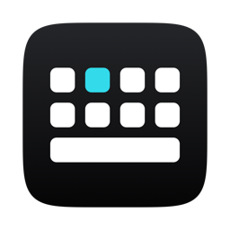
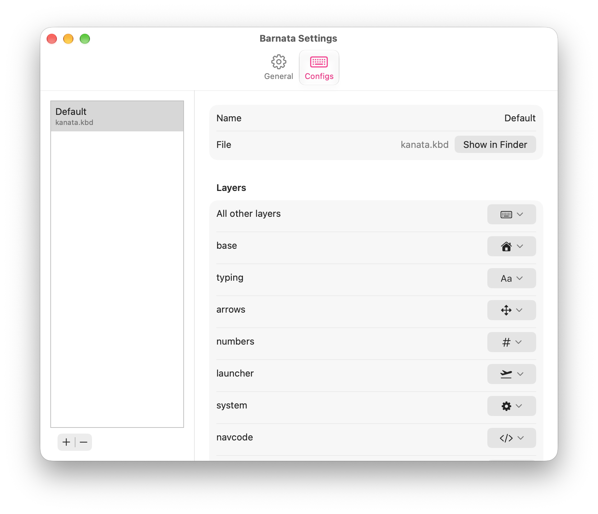
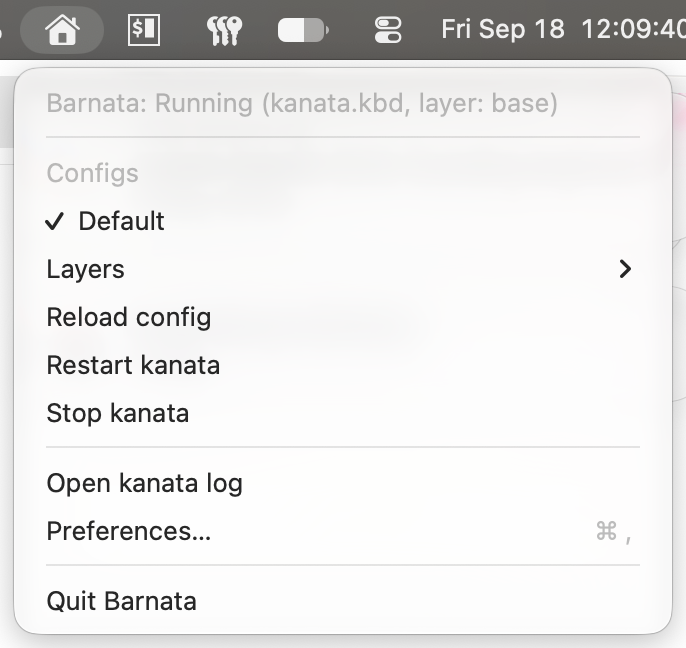

<h1 align="center">Barnata</h1>

<h3 align="center">
  
</h3>

<div align="center">
  Menu bar app for kanata on macOS
</div>

## Overview

[kanata](https://github.com/jtroo/kanata) runs as root under a launchd daemon registered from the app bundle.

Inspired by [kanata-tray](https://github.com/rszyma/kanata-tray). Barnata handles the setup for you: one approval in System Settings registers the daemon, permissions stay granted across kanata updates, and a settings window covers the common customization.

## Install

```sh
brew install --cask jacksluong/tap/barnata
```

## Usage

Open Preferences from the menu bar icon.

In **General**, all three permission rows need a green check before kanata can start. (Note: Accessibility is known as Device Control and Data Access on macOS 27 and later.)

**Configs** holds your kanata config files. Press `+` to add one. Each entry is a preset: a name, one `.kbd` file, and an icon per layer. To pull in configuration from more than one `.kbd` file, use kanata's [`include` keyword](https://github.com/jtroo/kanata/blob/main/docs/config.adoc#include-other-files).

Layer icons are [SF Symbols](https://developer.apple.com/sf-symbols/). The picker shows a curated set, but you may search for any symbol name.

<p align="center">
  
</p>

Presets appear in the menu bar. Click a preset to start it, click it again to stop.

<p align="center">
  
</p>

### Config file

Settings are stored in `~/.config/barnata/config.toml`, which you can also edit by hand. Barnata picks up changes on save.

```toml
[app]
show_dock_icon = false
launch_at_login = true
status_icons = "my-icons"     # directory under ~/.config/barnata/icons

[defaults]                    # inherited by presets that omit these keys
autorestart_on_crash = false
extra_args = ["--debug"]      # only kanata's logging and startup flags are accepted

[presets.Colemak]
kanata_config = "~/.config/kanata/colemak.kbd"
autorun = true                # at most one preset may set this

[presets.Colemak.layer_icons]
"*" = "keyboard"
nav = "arrow.up.arrow.down"

[presets.Gaming]
kanata_config = "~/.config/kanata/fps.kbd"
```

Status icons replace the menu bar image for each state. Name the files `default`, `crashed`, `paused`, or `reloading`. A `Template` suffix, as in `defaultTemplate.png`, makes macOS tint the image to match the menu bar.

## Uninstall

The best way to uninstall is through the Uninstall button in the Preferences window. Uninstalling through Homebrew will result in an orphaned "not found" entry in Login Items.

## License

Barnata is licensed under the GNU General Public License version 3, in `LICENSE`.
